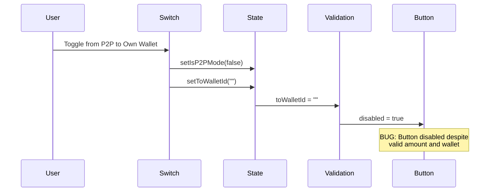

# Transfer Modal State Management Fix Plan

## Executive Summary

This document outlines an industry-standard solution for fixing a critical bug in the TransferModal where the submit button becomes disabled when switching from P2P mode back to Own Wallet transfer mode.

**The Bug Scenario:**

1. User opens transfer modal
2. Sets to P2P mode, enters address and amount → submit button enabled (correct)
3. User doesn't submit, but switches back to own wallet transfer mode
4. Amount remains (correct), receiver and payer wallets displayed (correct)
5. Transfer calculation is logical and possible
6. **BUT submit button is disabled (BUG)**

---

## Bug Analysis

### Root Cause

The bug is in [`TransferModal.tsx`](front/src/components/shared/modals/TransferModal.tsx) lines 258-267:

```typescript
<Switch
  checked={isP2PMode}
  onCheckedChange={(checked) => {
    setIsP2PMode(checked);
    setToWalletId("");       // <-- BUG: Clears destination when switching modes
    setRecipientPublicId("");
    setError(null);
  }}
/>
```

**Problem:** When the user toggles from P2P mode (checked=true) back to Own Wallet mode (checked=false), the `onCheckedChange` handler:

1. Sets `isP2PMode` to `false`
2. **Clears `toWalletId` to empty string** (line 263)
3. But no logic exists to auto-populate `toWalletId` when switching back

The validation condition at lines 363-370:

```typescript
disabled={
  isLoading ||
  !fromWalletId ||
  !hasValidAmount ||
  (!isP2PMode && !toWalletId) ||  // <-- TRUE when toWalletId is empty
  (isP2PMode && !recipientPublicId) ||
  !canTransfer
}
```

Since `toWalletId` is empty when switching back to Own Wallet mode, `(!isP2PMode && !toWalletId)` evaluates to `true`, disabling the button.

### Data Flow Diagram



---

## Industry Standard Solution

### Architectural Pattern: Reactive Mode Switching

The industry-standard React approach for handling mode-dependent state is:

1. **Effect-Driven State Sync**: Use `useEffect` to respond to mode changes and sync dependent state
2. **Smart Auto-Selection**: Automatically select valid defaults when mode changes require them
3. **Declarative Validation**: Validation should be reactive to all state changes

### Solution: Add useEffect for Mode Transition

Add a new `useEffect` that watches `isP2PMode` and auto-populates `toWalletId` when switching from P2P to Own Wallet mode:

```typescript
// Add after line 94 (after the wallet change reset effect)

// Auto-select destination wallet when switching from P2P to Own Wallet mode
useEffect(() => {
	// Only run when transitioning from P2P to Own Wallet mode
	if (!isP2PMode && fromWalletId) {
		// Only set if toWalletId is empty (was in P2P mode)
		if (!toWalletId) {
			const otherWallets = wallets.filter(
				(w) => w.id.toString() !== fromWalletId,
			);
			if (otherWallets.length > 0) {
				// Prefer primary if it's not the source, otherwise first available
				const destWallet =
					otherWallets.find((w) => w.primary) || otherWallets[0];
				setToWalletId(destWallet.id.toString());
			}
		}
	}
}, [isP2PMode, fromWalletId, toWalletId, wallets]);
```

This effect:

1. Triggers when `isP2PMode` changes to `false`
2. Checks if `toWalletId` is empty (meaning we're coming from P2P mode)
3. Auto-selects a valid destination wallet (preferring primary, then first available)
4. Ensures the validation condition `(!isP2PMode && !toWalletId)` stays `false`

---

## Implementation Steps

### Step 1: Add Mode Transition Effect in TransferModal

**File:** `front/src/components/shared/modals/TransferModal.tsx`

Add the following `useEffect` after line 94:

```typescript
// Auto-select destination wallet when switching from P2P to Own Wallet mode
// This fixes the bug where button becomes disabled when switching modes
useEffect(() => {
	// Only run when transitioning from P2P to Own Wallet mode
	if (!isP2PMode && fromWalletId) {
		// Only auto-select if toWalletId is empty (was in P2P mode)
		if (!toWalletId) {
			const otherWallets = wallets.filter(
				(w) => w.id.toString() !== fromWalletId,
			);
			if (otherWallets.length > 0) {
				// Prefer primary if it's not the source, otherwise first available
				const destWallet =
					otherWallets.find((w) => w.primary) || otherWallets[0];
				setToWalletId(destWallet.id.toString());
			}
		}
	}
}, [isP2PMode, fromWalletId, toWalletId, wallets]);
```

### Step 2: Verify Existing Fixes Are in Place

The following fixes should already be present (from previous plan):

1. **hasValidAmount validation** (lines 100-102) - ✅ Already implemented
2. **hasValidAmount in disabled condition** (line 366) - ✅ Already implemented
3. **Key-based modal reset in wallets.tsx** (lines 391-402) - ✅ Already implemented

---

## Complete Code Changes

### TransferModal.tsx - Full Changes

```typescript
// ADD after line 94 (new useEffect):

// Auto-select destination wallet when switching from P2P to Own Wallet mode
// This fixes the bug where button becomes disabled when switching modes
useEffect(() => {
	// Only run when transitioning from P2P to Own Wallet mode
	if (!isP2PMode && fromWalletId) {
		// Only auto-select if toWalletId is empty (was in P2P mode)
		if (!toWalletId) {
			const otherWallets = wallets.filter(
				(w) => w.id.toString() !== fromWalletId,
			);
			if (otherWallets.length > 0) {
				// Prefer primary if it's not the source, otherwise first available
				const destWallet =
					otherWallets.find((w) => w.primary) || otherWallets[0];
				setToWalletId(destWallet.id.toString());
			}
		}
	}
}, [isP2PMode, fromWalletId, toWalletId, wallets]);
```

---

## Testing Checklist

### Bug Scenario Verification

- [ ] Open TransferModal, enter P2P address and amount - button should be ENABLED
- [ ] Toggle switch from P2P to Own Wallet mode - button should remain ENABLED
- [ ] Verify destination wallet is auto-selected when switching modes
- [ ] Verify transfer calculation shows correctly after mode switch
- [ ] Submit transfer successfully

### Regression Testing

- [ ] Open TransferModal for Wallet A in Own Wallet mode - should auto-select destination
- [ ] Open TransferModal for Wallet A in P2P mode - should work correctly
- [ ] Close modal and open for different wallet - should reset correctly
- [ ] WithdrawModal and DepositModal still work correctly

---

## Benefits of This Solution

1. **Reactive State Management**: Mode transitions automatically trigger appropriate state updates
2. **No Manual Intervention**: User doesn't need to manually select destination wallet after mode switch
3. **Industry Standard**: Follows React best practices for effect-driven state synchronization
4. **Maintainable**: Clear logic that responds to state changes declaratively
5. **Backward Compatible**: Doesn't affect existing functionality

---

## Related Patterns

| Pattern                        | Use Case                                 |
| ------------------------------ | ---------------------------------------- |
| useEffect for mode transitions | Auto-sync dependent state on mode change |
| Smart auto-selection           | Provide sensible defaults automatically  |
| Key-based component remounting | Reset all state when switching contexts  |
| Declarative validation         | Reactive validation based on all state   |

---

_Document Version: 2.0_
_Last Updated: 2026-02-19_
_Component: TransferModal_
_Issue: Mode switch causes button disable bug_
